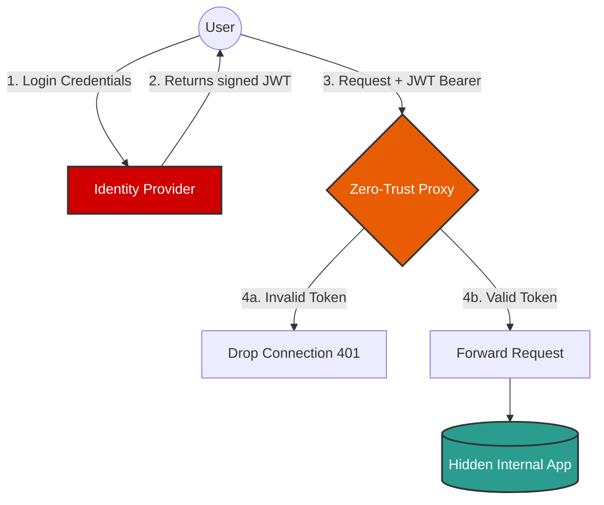

# Zero-Trust Network Access (ZTNA) Proxy

[](https://www.python.org/downloads/)
[](https://flask.palletsprojects.com/)
[](https://www.ncsc.gov.uk/collection/zero-trust-architecture)
[](https://opensource.org/licenses/MIT)

> **Development Context:** This is a test project I built while learning about Zero-Trust Architectures, cryptographic token signing, and identity-aware proxies in Python.

## Overview

In traditional network security, anything inside the corporate firewall is trusted. If an attacker gets inside, they gain access to everything. 

This project implements a **Zero-Trust Architecture (ZTA)**. It assumes the network is already compromised. Before any request is allowed to reach the hidden internal application, it must pass through the **Identity Proxy**. The proxy verifies the user's identity using a JSON Web Token (JWT) on every single request.

## Project Architecture

### Visual Flow



The repository contains three microservices:

1. **Identity Provider (`auth_server.py`)**: 
   - Acts as the authentication gateway.
   - Verifies user credentials and generates a secure JSON Web Token (JWT) signed with the `HS256` algorithm. The token expires in 15 minutes.
2. **Zero-Trust Proxy (`ztna_proxy.py`)**: 
   - Sits at the edge of the network and intercepts all incoming web traffic.
   - Extracts the `Authorization: Bearer` token and verifies its cryptographic signature. 
   - If the token is valid, it forwards the traffic to the protected internal app. If invalid, it drops the connection.
3. **Internal Application (`dummy_internal_app.py`)**: 
   - A hidden backend resource that simulates classified data. It is bound strictly to `localhost` (`127.0.0.1`) and cannot be accessed from the outside internet.

## Technologies Used

- **Web Framework**: Python Flask, requests
- **Cryptography**: PyJWT, cryptography
- **Environment Management**: python-dotenv

## How to Run Locally

### Prerequisites
Make sure you have `Python 3.11+` and `git` installed.

### Setup Steps

1. **Clone the repository:**
   ```bash
   git clone https://github.com/rakesh-pathuri/Zero-Trust-Network-Access-ZTNA-Proxy.git
   cd Zero-Trust-Network-Access-ZTNA-Proxy
   ```

2. **Create a Virtual Environment:**
   ```bash
   python -m venv .venv
   .\.venv\Scripts\activate   # Windows
   ```

3. **Install Dependencies:**
   ```bash
   pip install -r requirements.txt
   ```

4. **Configure Environment:**
   Create a `.env` file in the main folder (you can copy `.env.example`) and define your secret key:
   ```env
   JWT_SECRET_KEY="your_super_secret_key"
   INTERNAL_APP_URL="http://127.0.0.1:8000"
   ```

### Execution

You must run all three services simultaneously in three separate terminals:

1. **Start the Hidden Internal App:** `python dummy_internal_app.py`
2. **Start the Identity Provider:** `python auth_server.py`
3. **Start the Zero-Trust Proxy:** `python ztna_proxy.py`

### Testing the Architecture

If you try to access the proxy `http://localhost:5000` directly in your browser, you will be blocked with a `401 Unauthorized` error because you don't have a cryptographic identity token. 

To access it, you must first request a token from the Auth Server, and then attach it as a `Bearer` token in the headers of your request to the proxy.

#### Using PowerShell:

1. **Get the Token:**
   ```powershell
   $body = @{ username="admin"; password="admin_secure_password" } | ConvertTo-Json
   $response = Invoke-RestMethod -Uri "http://localhost:5001/login" -Method Post -Body $body -ContentType "application/json"
   $token = $response.token
   echo $token
   ```

2. **Access the Proxy with the Token:**
   ```powershell
   $headers = @{ Authorization = "Bearer $token" }
   Invoke-RestMethod -Uri "http://localhost:5000" -Headers $headers
   ```

#### Using cURL:

1. **Get the Token:**
   ```bash
   curl -X POST http://localhost:5001/login -H "Content-Type: application/json" -d '{"username":"admin", "password":"admin_secure_password"}'
   ```

2. **Access the Proxy with the Token:**
   *(Replace `<YOUR_TOKEN>` with the token received from the previous command)*
   ```bash
   curl -X GET http://localhost:5000 -H "Authorization: Bearer <YOUR_TOKEN>"
   ```

---

### Authorship
**Developed by:** Rakesh Pathuri
*Built as a learning project to explore modern identity-aware network security.*
